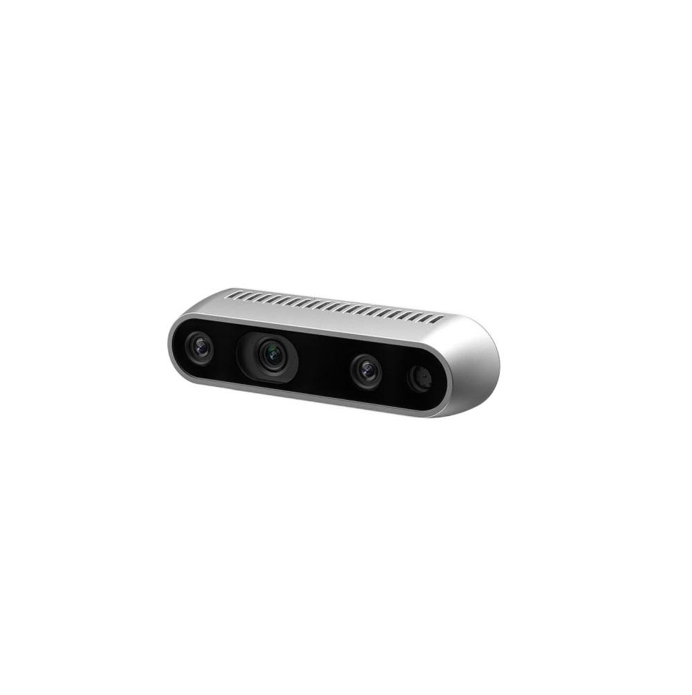
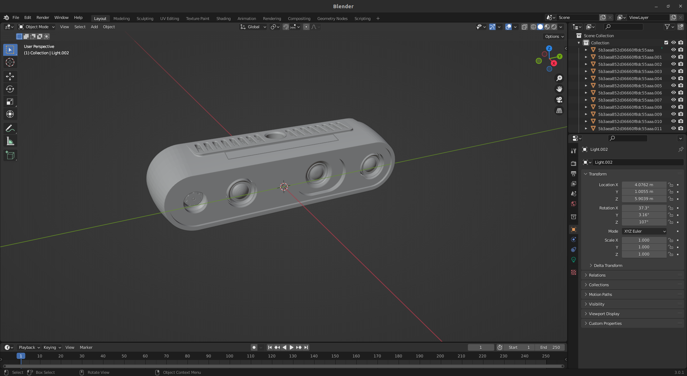
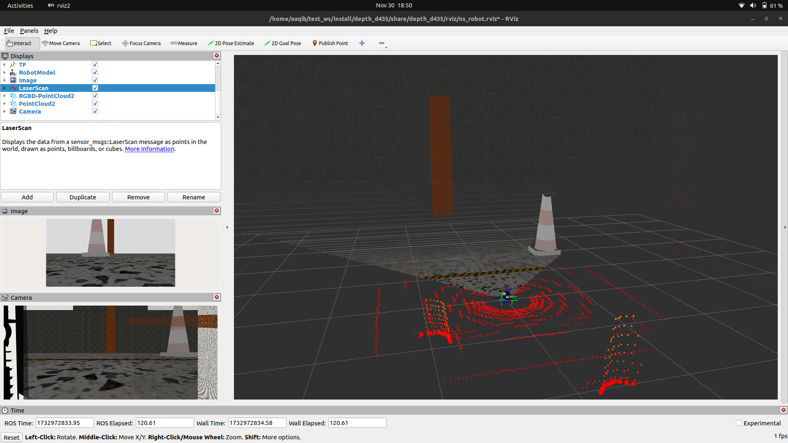
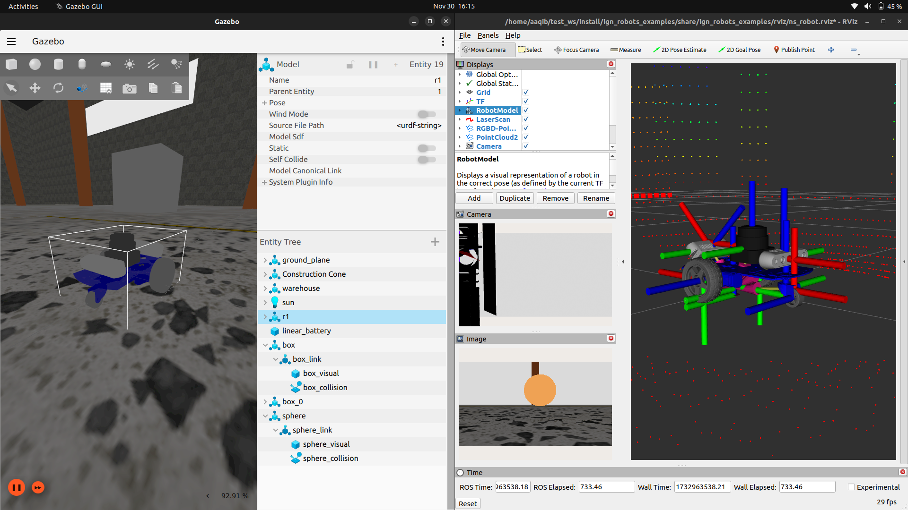
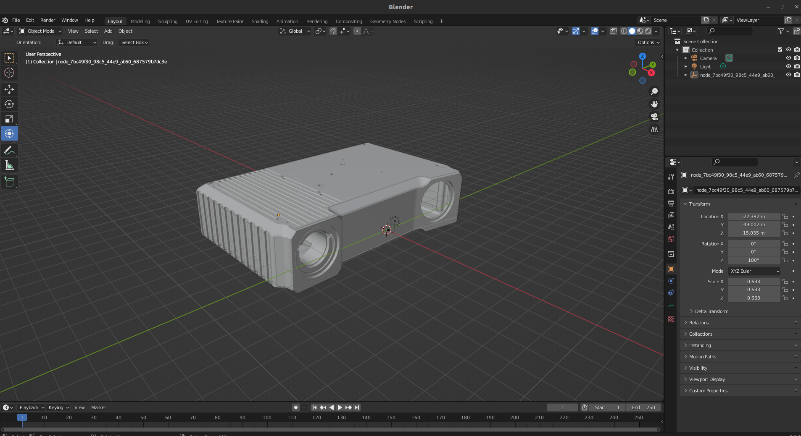
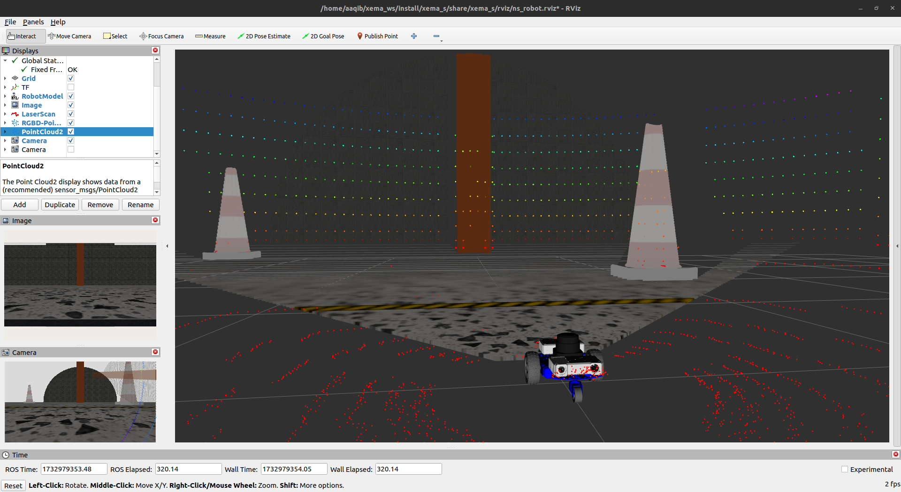
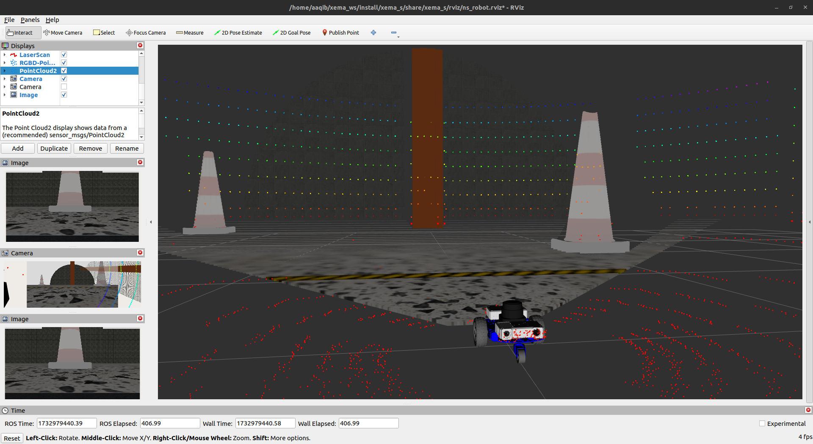

# Depth Camera Simulation: RealSense D435 and Xema-S 




## Disclaimer

**Note:** Due to the lack of official Gazebo Ignition plugins for RealSense D435 and Xema-S cameras, this simulation uses Gazebo's standard RGB-D camera sensors configured to mimic the specific properties of these depth cameras. The simulation leverages `ros_gz_bridge` for ROS 2 integration.

## Project Overview

This project provides a detailed simulation of two depth cameras:
1. Intel RealSense D435
2. Xema-S Depth Camera

The simulation includes:
- Realistic camera parameter configurations
- RGB and depth image generation
- ROS 2 topic bridging
- Mounting on a simple differential drive robot

## Prerequisites

### System Requirements
- Ubuntu 22.04 LTS
- ROS 2 Humble
- Gazebo Ignition Fortress

### Initial Setup

1. **Update System**
```bash
sudo apt update && sudo apt upgrade -y
```

2. **Install ROS 2 Humble**
```bash
sudo apt install -y ros-humble-desktop
```

3. **Install Gazebo Ignition Fortress**
```bash
sudo wget https://packages.osrfoundation.org/gazebo.gpg -O /usr/share/keyrings/pkgs-osrf-archive.gpg
echo "deb [arch=amd64 signed-by=/usr/share/keyrings/pkgs-osrf-archive.gpg] https://packages.osrfoundation.org/gazebo/ubuntu-stable `lsb_release -cs` main" | sudo tee /etc/apt/sources.list.d/gazebo-stable.list
sudo apt update
sudo apt install -y ignition-fortress
```

4. **Install ROS-Gazebo Bridge**
```bash
sudo apt install -y ros-humble-ros-gz-bridge
```

## Intel RealSense D435 Simulation

### Workspace Preparation

1. **Clone Repository**
```bash
git clone https://github.com/aaqibmahamood/Depth_Camera_Simulation.git
```

3. **Copy to Home Directory**
```bash
# Ensure you're in the Home directory where you have your workspaces. Copy d435_ws into home from Depth_Camera_Simulation folder.
cp -r d435_ws ~/
```

### Camera Specifications - RealSense D435

#### RGB Camera
- **Resolution**: 1920x1080
- **Horizontal FOV**: 80 degrees
- **Update Rate**: 30 Hz
- **Distortion Model**: Realistic radial and tangential distortion
- **Intrinsic Camera Matrix**: Calibrated to D435 specifications

#### Depth Camera
- **Resolution**: 1280x720
- **Horizontal FOV**: 80 degrees
- **Depth Range**: 0.2m - 10m
- **Noise Model**: Gaussian noise (mean 0, stddev 0.0025)
- **Update Rate**: 30 Hz

### Building and Launching

1. **Build Workspace**
```bash
cd ~/d435_ws
colcon build
source install/setup.bash
```

2. **Launch Simulation**
```bash
ros2 launch depth_d435 one_robot_ign_launch.py
```

### Visualization Examples


### Intel RealSense D435 DAE File





#### Demonstration Video
https://github.com/user-attachments/assets/6a620f1a-3d72-453e-939d-b562cd7cb084

## Xema-S Depth Camera Simulation

### Workspace Preparation

1. **Clone Repository**
```bash
git clone <repository-url-for-xema-s>
```

2. **Copy to Home Directory**
```bash
# Ensure you're in the src directory
cp -r xema_ws ~/
```

### Camera Specifications - Xema-S

#### RGB Camera
- **Resolution**: 1920x1080
- **Horizontal FOV**: 70 degrees
- **Update Rate**: 30 Hz
- **Distortion Coefficients**: Precisely tuned
- **Intrinsic Camera Matrix**: Matched to Xema-S optics

#### Depth Camera
- **Resolution**: 1280x720
- **Horizontal FOV**: 70 degrees
- **Depth Range**: 0.1m - 8m
- **Noise Model**: Gaussian noise (mean 0, stddev 0.0025)
- **Update Rate**: 30 Hz

### Building and Launching

1. **Build Workspace**
```bash
cd ~/xema_ws
colcon build
source install/setup.bash
```

2. **Launch Simulation**
```bash
ros2 launch xema_s one_robot_ign_launch.py
```

### Visualization Examples


### Open3D's XEMA-S DAE File






## Advanced Configuration

### Optical Frames
- Dedicated optical frames for both RGB and depth cameras
- Precise alignment with base link
- Consistent orientation and positioning

### Simulation Parameters
- **Clip Distances**:
  - D435: Near clip 0.2m, Far clip 10m
  - Xema-S: Near clip 0.1m, Far clip 15m
- Accurate lens intrinsics and distortion parameters

## Bridging ROS 2 Topics

To bridge camera topics:
```bash
ros2 run ros_gz_bridge parameter_bridge /camera/depth/image@sensor_msgs/msg/Image@ignition.msgs.Image
ros2 run ros_gz_bridge parameter_bridge /camera/color/image@sensor_msgs/msg/Image@ignition.msgs.Image
```

## Troubleshooting

- Verify ROS 2 and Gazebo Ignition installations
- Check topic names and message types
- Ensure correct camera placement in Gazebo world

## Contributing

Contributions are welcome! 🤖

1. Fork the repository
2. Create your feature branch
3. Commit your changes
4. Push to the branch
5. Open a Pull Request


## Acknowledgments

- ROS 2 Community
- Gazebo Ignition Team
- Intel RealSense
- Xema-S Manufacturers
